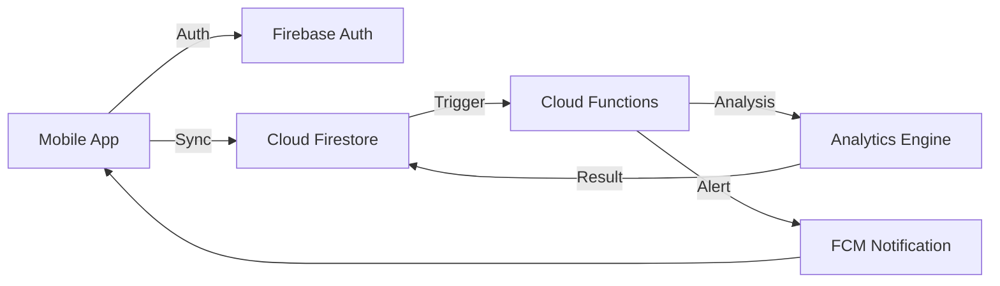

# FlowTask 🌊
> **"Turn your daily chaos into focused progress."**

[](https://opensource.org/licenses/MIT)
[](https://flutter.dev)
[](https://firebase.google.com)
[](https://makeapullrequest.com)

FlowTask is a modern, productivity-focused To-Do List mobile application designed to help individuals organize tasks, maintain deep focus, and track productivity patterns. Unlike traditional task managers, FlowTask combines minimalist task management with **Productivity Intelligence** to help you understand how you work best.

---

## 🚀 The Vision
Most to-do list applications only allow users to list tasks. They do not help users:
- **Stay Focused:** No built-in mechanics for deep work.
- **Understand Patterns:** No data on *when* or *how* you are most productive.
- **Maintain Consistency:** No gamified feedback loops for long-term progress.

**FlowTask solves this.** It transforms a passive list into an active intelligence tool.

## ✨ Core Features
- 🧠 **Smart Task Management:** Minimalist, clutter-free task organization with priority levels.
- ⏱️ **Deep Focus Engine:** Integrated Pomodoro-style timer tied directly to your tasks.
- 📊 **Productivity Intelligence:** Behavioral analytics that reveal your most productive hours and completion rates.
- 🔥 **Streak Control:** Gamified consistency tracking to keep you motivated.
- 🔔 **Intelligent Reminders:** AI-optimized notification schedules to respect your flow state.

## 🛠 Tech Stack
- **Frontend:** Flutter (Latest Stable)
- **Backend:** Firebase (Authentication, Firestore, Cloud Functions, FCM)
- **State Management:** Riverpod (Functional & Reactive)
- **Design:** Modern Glassmorphism & Material 3
- **Analytics:** Firebase Analytics & Custom Intelligence Engine

## 🏗️ System Architecture
The application follows a clean, layered architecture ensuring scalability and testability.



## 📦 Project Structure
```text
flowtask-smart-todo-app/
├── mobile_app/         # Full Flutter Application logic
│   ├── lib/
│   │   ├── core/       # Theme, utils, and global configs
│   │   ├── features/   # Feature-based domain logic (Auth, Tasks, Analytics)
│   │   ├── services/   # Firebase & API integrations
│   │   └── widgets/    # Reusable UI components
├── backend/            # Firebase Rules & Cloud Functions
├── landing_page/       # Next.js promotional website
├── assets/             # Branding, icons, and animations
├── docs/               # System architecture & strategy
└── legal/              # Compliance documents (GP Store Ready)
```

## 💰 Monetization & Growth
FlowTask operates on a **Freemium** model:
- **Free:** Core task management & standard Focus Timer.
- **Premium:** Advanced behavioral heatmaps, Smart Scheduling, and Extended Reports.

*Check [docs/strategy.md](file:///docs/strategy.md) for the full 10k user acquisition plan.*

## ⚖️ Legal & Compliance
FlowTask is fully compliant with modern Google Play Store policies:
- [Privacy Policy](file:///legal/privacy_policy.md)
- [Terms of Service](file:///legal/terms_of_service.md)
- [Data Usage Policy](file:///legal/data_usage_policy.md)
- [Disclaimer](file:///legal/disclaimer.md)

---

## 🤝 Getting Started
1. **Clone:** `git clone https://github.com/nayrbryanGaming/flowtask-smart-todo-app.git`
2. **Setup Flutter:** Run `flutter pub get` in `mobile_app/`.
3. **Configure Firebase:** Add your `google-services.json` to `android/app/`.
4. **Run:** `flutter run` (Use a physical device for accurate focus timer testing).

---
Built with ❤️ by the FlowTask Team.
"Helping you reclaim your time, one task at a time."
