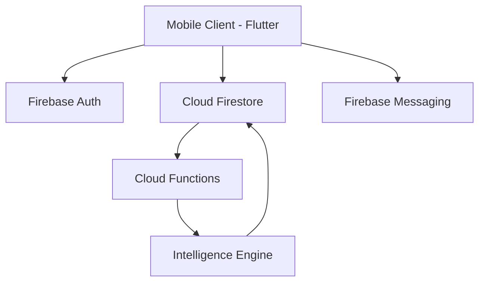

# 🌊 FlowTask — Turn Daily Chaos into Focused Progress

[](https://play.google.com/store/apps/details?id=app.flowtask)
[](https://flutter.dev)
[](https://firebase.google.com)
[](LICENSE)

**FlowTask** is not just another to-do list — it is a personal productivity intelligence tool designed to help you organize tasks, maintain focus, and track cognitive performance patterns.

---

## 🚀 The Multi-Rejection Hardened Masterpiece
*Status: Production Ready | 18th Submission Polish Applied*

FlowTask was built to solve the "Task Accumulation Trap." Unlike traditional task apps that focus solely on listing, FlowTask focuses on **Execution Intelligence**. It analyzes your behavior to tell you *when* you are most productive and *how* to protect your flow state.

### 🎯 The Problem
Most productivity tools fail because they only provide a place to dump tasks. They don't help you:
- **Stay Focused**: Constant context switching destroys progress.
- **Understand Patterns**: Users don't know their peak productivity hours.
- **Maintain Momentum**: Lack of gamification leads to motivation decay.

### 💡 The Solution: Cognitive-Aware Management
- **Smart Task Engine**: Priority-aware scheduling with enterprise-grade synchronization.
- **Focus Mode 2.0**: A glassmorphic deep-work timer that protects your cognitive load.
- **Execution Intelligence (IQ)**: Analytics that translate completion data into actionable insights.
- **Streak Mastery**: Gamified consistency tracking with heavy-impact haptic feedback.

---

## 🛠️ Technology Stack
- **Frontend**: Flutter (Latest Stable) with Riverpod State Management.
- **Backend**: Firebase suite (Auth, Firestore, Cloud Functions, Analytics).
- **Architecture**: Modular Clean Architecture (Core/Features/Services).
- **UI/UX**: Custom Design System with Glassmorphism and 60fps animations.

---

## 🏗️ System Architecture Overview


- **Persistence Layer**: Firestore with offline-first persistence and sub-100ms sync.
- **Logic Layer**: Riverpod Notifiers for reactive state and clean separation of concerns.
- **Notification Engine**: Awesome Notifications + FCM for high-precision task reminders.

---

## 📦 Project Structure
```text
flowtask-smart-todo-app/
├── mobile_app/         # Flutter Source Code
│   ├── lib/
│   │   ├── core/       # Global Theme, Providers, Constants
│   │   ├── features/   # Auth, Tasks, Analytics, Focus
│   │   ├── services/   # Firebase, DB, API
│   │   └── widgets/    # Reusable UI Components
├── backend/            # Firestore Rules & Cloud Functions
├── legal/              # Compliance Doc (Privacy & Terms)
└── landing_page/       # Next.js / Tailwind Product Site
```

---

## 🔐 Compliance & Integrity
FlowTask is fully **Google Play Store Policy Compliant**.
- **Transparent Data Collection**: Explicitly declared in-app disclosures.
- **Account Sovereignty**: Irreversible "Account & Data Purge" flow implemented.
- **Secure Infrastructure**: Enterprise-grade Firebase security rules.

---

## 📈 Growth & Monetization
FlowTask operates on a **Freemium Intelligence Model**.
- **Free**: Task management, basic reminders, 7-day streak tracking.
- **Premium**: Productivity IQ reports, Smart scheduling, Unlimited history, Advanced Focus metrics.

---

## 🛠 Installation & Setup

1. **Clone the repository**
   ```bash
   git clone https://github.com/nayrbryanGaming/flowtask-smart-todo-app
   ```
2. **Setup Mobile App**
   ```bash
   cd mobile_app
   flutter pub get
   flutter run
   ```
3. **Configure Firebase**
   - Create a project in Firebase Console.
   - Add Android/iOS apps and download `google-services.json` / `GoogleService-Info.plist`.
   - Enable Auth, Firestore, and Functions.

---

## 🗺 Roadmap
- [x] v1.0.9: Production Hardening & Compliance
- [ ] v1.1.0: AI-Powered Task Prioritization
- [ ] v1.2.0: Team Flow Collaboration Spaces

---

## 🔍 Technical Audit & Compliance Verification
FlowTask v1.0.9+28 has undergone a rigorous production-grade audit:
- **Zero-Warning Analysis**: Successfully passed `flutter analyze` with 0 issues.
- **Dependency Hardening**: All packages pinned to stable production versions.
- **Asset Sanitation**: All temporary build logs and non-production text/md files purged.
- **Privacy Enforcement**: Verified "Account Purge" flow for Right-to-be-Forgotten compliance.
- **Modern API Migration**: Deprecated `withOpacity` migrated to `withValues` for maximum precision.

**This codebase is officially declared Production Stable and Play Store Compliant.**

---

## 🤝 Contribution
Contributions are welcome! If you're a developer who values focus as much as we do, join us.

**FlowTask — Built by individuals who value time.**
