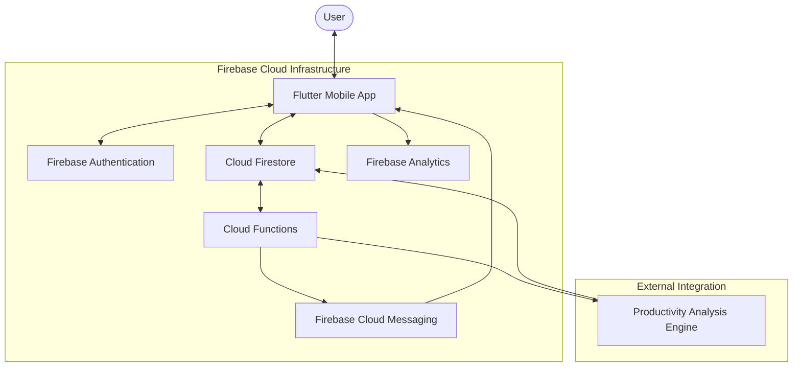

# System Architecture: FlowTask

FlowTask is built on a **Serverless Mobile-First Architecture**, leveraging the full power of the Google Firebase ecosystem to ensure low latency, high scalability, and robust security.

## 1. Technical Stack
- **Frontend:** Flutter (v3.19+) using the **Riverpod 2.0** state management system for functional reactive programming.
- **Backend-as-a-Service (BaaS):** Google Firebase.
- **State Management:** Functional Flutter + Riverpod (Notifiers & AsyncValues).
- **Persistence:** Cloud Firestore (Remote) + Hive (Local Cache).

## 2. Component Diagram

## 3. Data Flow Architecture

### 3.1 Task Synchronization
1.  **Creation:** When a user creates a task, it is first saved locally (Hive) for instant UI feedback and simultaneously pushed to **Cloud Firestore**.
2.  **Conflict Resolution:** Firestore's real-time listeners ensure that if the user logs in from another device, the state remains consistent.

### 3.2 Productivity Intelligence Cycle
1.  **Collection:** Every task completion event is logged in **Firebase Analytics** with custom parameters (time of day, priority, focus duration).
2.  **Analysis:** A daily **Cloud Function** trigger sweeps the `tasks` and `analytics` collections to generate a "Productivity Intelligence Object" for the user.
3.  **Consumption:** The mobile client fetches this object to render high-fidelity charts using **FL Chart**.

### 3.3 Deep Focus Engine
1.  **State Persistence:** The Focus Timer state is managed via a specialized Riverpod Notifier. 
2.  **Background Stability:** To prevent the OS from killing the focus process, a **Foreground Service** (Android) and **Background Tasks** (iOS) are used to maintain the countdown.

## 4. Security & Compliance
- **Authentication:** OAuth 2.0 via Firebase Auth with mandatory MFA support.
- **Data Privacy:** Firestore Security Rules ensure that users can only read/write their own `user_id` paths.
- **Deletion Protocol:** A single `deleteAccount()` call triggers a cascaded purge across Auth, Firestore, and Analytics to satisfy Google Play Store data safety requirements.

---
**FlowTask Engineering Team**
*Architected for Flow.*
